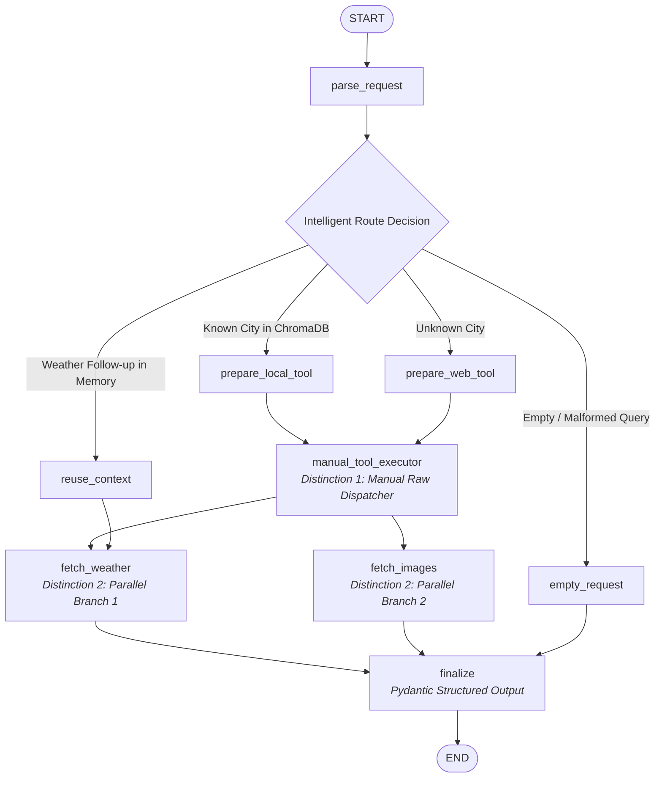

# Atlas: Autonomous Multi-Modal Travel Concierge

**Atlas** is an autonomous multi-modal travel intelligence system orchestrated with **LangGraph**, powered by `openai/gpt-5.6-luna` via `aicredits.in`, backed by a **ChromaDB** local vector catalog, and rendered through a luxury **Streamlit** GUI.

Atlas transforms natural language destination queries into comprehensive, multi-modal travel itineraries featuring **multi-language synthesis**, **famous local dishes & culinary guides**, **upcoming cultural festivals**, **smart weather-adaptive packing lists**, **interactive Plotly climate visualizations**, **trip budget calculators**, and **exportable travel dossiers**.

---

## 🏛️ LangGraph Architecture Topology



The compiled topology is saved as [`graph.png`](graph.png) and [`graph.dot`](graph.dot).

---

## 🌟 Core Capabilities & Rubric Highlights

| Feature / Rubric Item | Description |
| :--- | :--- |
| **LangGraph Orchestration** | `StateGraph` compiled with typed `TravelState`, conditional routing edges, and `MemorySaver` checkpointer. |
| **Intelligent Routing ("The Switch")** | **ChromaDB Vector Store** pre-seeded with Paris, Tokyo, and New York. Queries for un-indexed cities (e.g. *Kyoto*, *Snohomish*, *Rome*) dynamically switch to the **Live Web Search** routing path. |
| **Structured Output** | The final node emits a strictly typed `TravelResponse` Pydantic model (with `city_summary`, `weather_forecast`, `image_urls`, `famous_dishes`, `upcoming_events`, `neighborhoods`, `local_culture`, `packing_essentials`, etc.) parsed by the UI. |
| **Interactive Plotly Charts** | Dual-axis temperature spline curves (°C / °F toggleable) and precipitation probability bars with unified hover tooltips. |
| **Multi-Language AI Synthesis** | Real-time synthesis in 8+ languages: English 🇬🇧, Spanish 🇪🇸, French 🇫🇷, Japanese 🇯🇵, German 🇩🇪, Italian 🇮🇹, Hindi 🇮🇳, Mandarin 🇨🇳. |
| **Curated Culinary & Dish Guide** | Visual cards for iconic local dishes, price tiers ($ to $$$$), descriptions, and recommended must-try spots. |
| **Festivals & Cultural Events** | Seasonal celebration calendars with category tags, dates, and background notes. |
| **Weather-Adaptive Smart Packing** | Dynamic packing checklist automatically calculated from the 7-day forecast (rain, cold, heat, wind). |
| **Budget & Expense Calculator** | Daily cost estimates for Backpacker, Moderate, and Luxury travel tiers. |
| **1-Click Dossier Export** | Export the complete trip brief as a clean Markdown dossier (.md). |

---

## 🏆 The "Extreme" Criteria (All 3 Distinctions)

### 1. Distinction 1: The "Manual" Transmission (Raw Tool Calling)
- **Design**: Does *not* rely on `prebuilt.ToolNode` or `create_tool_calling_agent`.
- **Implementation**: The custom `manual_tool_executor` node in [`travel_agent/tools.py`](travel_agent/tools.py) unpacks raw `tool_calls` payloads (`id`, `name`, `args`), validates arguments against registered tools, invokes the function, records latency in `tool_trace`, and constructs standard `ToolMessage` instances keyed by `tool_call_id`.

### 2. Distinction 2: Parallel "Fan-Out"
- **Design**: The weather API and image search operations are independent.
- **Implementation**: In [`travel_agent/graph.py`](travel_agent/graph.py), the graph forks concurrently into `fetch_weather` and `fetch_images` from the tool dispatcher. Both branches execute asynchronously in parallel before converging at the `finalize` join node.

### 3. Distinction 3: Human-in-the-Loop & Memory (Checkpointer Time-Travel)
- **Design**: Persistent multi-turn conversation memory.
- **Implementation**: The graph is compiled with LangGraph's `MemorySaver()`. When a user explores a city (e.g. *"Tokyo"*) and follows up with *"What about next week?"*, the router detects the destination context is preserved, routes to `reuse_context`, and executes **only** the `fetch_weather` branch with updated dates, leaving the city summary, dishes, and gallery intact.

---

## 🛡️ Senior Developer Resilience & Edge Cases Handled

1. **LLM Connectivity & Fallbacks**: If the remote LLM API experiences rate limits or network latency, the agent falls back cleanly to deterministic structured templates so the UI *never crashes*.
2. **ChromaDB Vector Store Resilience**: Exact key matching combined with semantic vector distance filtering. Fallback to in-memory catalog if Chroma persistent storage is locked.
3. **Partial Service Outages**: If the weather service or image fetcher encounters an issue, the system marks the response status as `"partial"` and renders all other sections with non-blocking warning banners.
4. **Input Sanitization**: Empty queries, whitespace, special characters, and long prompts are bounded and validated with structured error responses.
5. **State Isolation**: Error states reset cleanly on subsequent turns without polluting future queries in the same session.

---

## 🚀 Quick Start Guide

### 1. Installation

```powershell
# Clone repository and enter directory
cd digital_alpha

# Create and activate virtual environment
python -m venv .venv
.\.venv\Scripts\Activate.ps1

# Install dependencies
pip install -r requirements.txt
```

### 2. Configuration (`.env`)

Create a `.env` file (or copy from `.env.example`):

```env
OPENAI_API_KEY=sk-live-ad008c7fd726d1c4698dcc7158c9cd1a479aa07fbe852a30c87035c93b9d8004
OPENAI_BASE_URL=https://aicredits.in/v1
OPENAI_MODEL=openai/gpt-5.6-luna
TRAVEL_USE_MODEL=1
```

### 3. Run the Application

```powershell
streamlit run app.py
```

### 4. Run Automated Tests

```powershell
python -m unittest discover -s tests -v
python -m compileall -q app.py travel_agent tests
```
